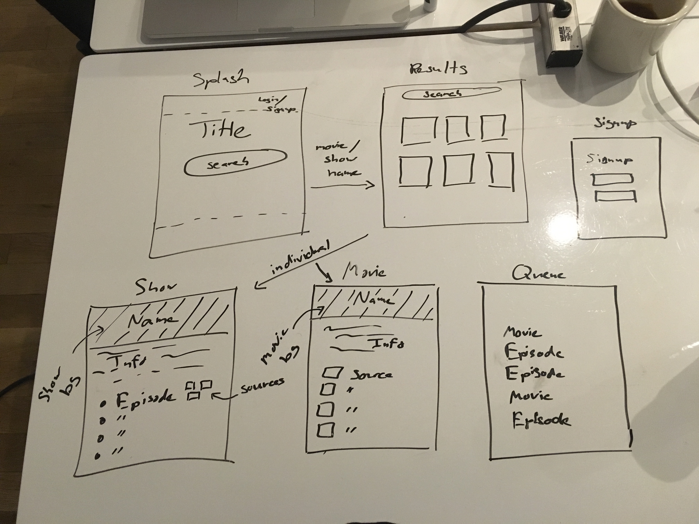

# Project 2: Stream Search

---
## Find any movie or tv show!

Search for any movie or tv show you can think of! Create an account and log in to create a queue of movies and episodes that you plan on watching.

---

### Technologies Used

For this project, I used the following NPM packages:

* **bcryptjs** to handle password encryption
* **body-parser** to handle server-side data parsing
* **express**
* **express-session** to handle user sessions
* **fetch** to handle backend api requests
* **method-override** to handle 'update' and 'delete' functionality
* **mustache-express** as a templating engine
* **pg-promise** to manipulate the local databse

---

### Process/Design Diary

Similar to Project 1, I set out with the aim to create an app that I would realistically use in the future. I've definitely run into the issue where I want to watch a movie/tv show, but I don't know what streaming service it's on (Netflix, HBO Go, Amazon, etc.), so this app seeks to solve that problem.

I'm using the **GuideBox** api, which pulls movie and tv info from a variety of sources. This was vastly preferable to pulling from a separate database for each service I wanted access to. Unfortunately, Netflix is not included in GuideBox's list, and Netflix's official API is currently under construction, so I didn't have access to that.
From the home page, the user can search for a movie or tv show. The query will return a list of all matching media in GuideBox's database. 
You can then click on an individual entry, and you'll be redirected to a page with info for that movie or show.
The info page includes the name, year released, rating, overview and art for each given movie or show.
From any page the user can sign up and log in. If they're logged in, they can then view their movie queue.
If the user is logged in at the info page, they can add that specific movie to their queue.

---

### What's Left

Honestly, I'm probably going to continue working on this project, as there are still a few things I'd like to add:

* Trailer functionality for movies is currently somewhat broken (if a movie doesn't have a trailer, the info page won't load), so I need to debug that.
* The tv show search doesn't yet return episodes. This will eventually be a separate api call once the info page has loaded
* Cleaning up the user experience (subtle animations, a more streamlined login and signup process, nicer overall css)
* Add a 'page loading' animation, so the user knows the app is pulling/loading from the api, and hasn't crashed
* Change info page background to movie/show art

---

## Wireframes

